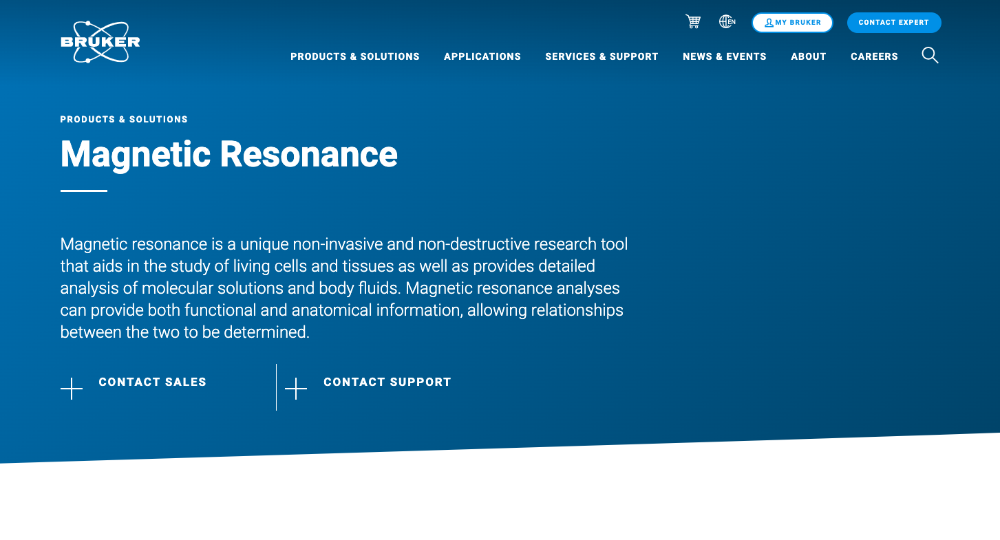
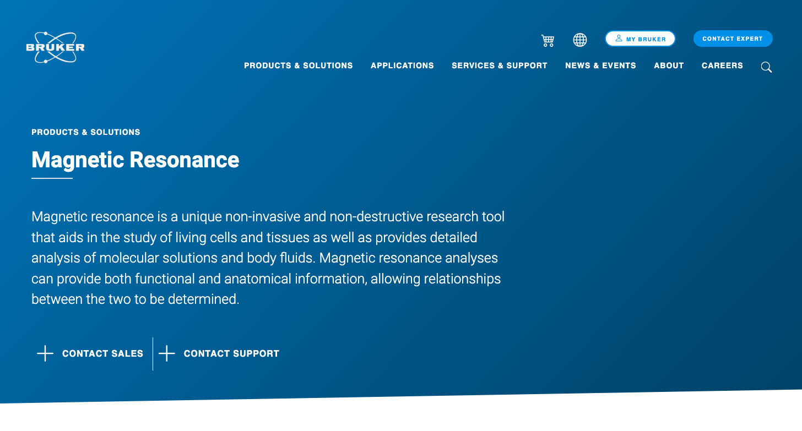

# brukerProject

### _This is a static landing page I created using Angular, to stand out as a Bruker applicant._

## Table of Contents

- [Media](#Media)

- [Deployed Site](#deployed-site)

- [Features](#Features)

- [Contributors](#Contributors)

- [Contact](#Contact)

- [Project Status](#project-status)

- [License](#License)

## Media

Products and Solutions Page:

What I've got so far:

## Deployed Site

Coming Soon

## Features

    - Single-page application built with Angular, CSS, Bootstrap Icons and Canva (for all artistic elements).

## Contributors

This application was created by Celeste Moore.

## Contact

If you have any questions about this repository, contact celestealexmoore via GitHub or reach out via email:
celestealexmoore@gmail.com.

## Project Status

In Progress

---

## License

© 2021 _celestealexmoore_
